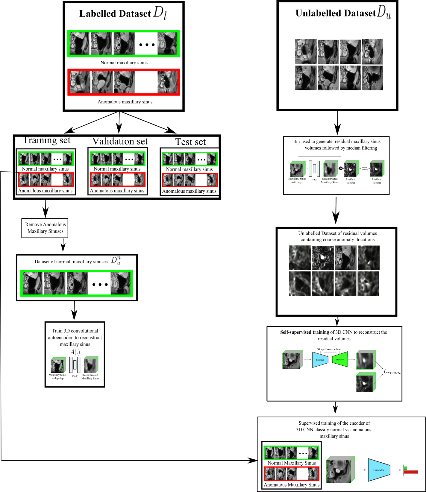

# Self-Supervised Method for Paranasal Anomaly Classification in the Maxillary Sinus

## Abstract

Paranasal anomalies refer to opacities that appear in the sinuses during routine radiological examinations of the head. Deep learning-based Computer Aided Diagnostics (CAD) have gained popularity for diagnosing these anomalies automatically. However, the morphological diversity of these opacities makes it challenging for deep learning models to generalize to novel cases. Therefore, to enhance the generalization capability of these models, large annotated datasets are necessary. This requirement places a considerable burden on clinicians who have to manually annotate new samples, leading to fatigue and increased workload.

In this study, we propose a novel self-supervised task to distinguish between normal and anomalous maxillary sinuses (MS). Our self-supervision strategy involves training an autoencoder to reconstruct healthy MS. We generate residual MS volumes by subtracting input MS volume from the reconstructed MS volume predicted by the autoencoder on the unlabelled data. Next, we train a U-Net based encoder-decoder model to reconstruct the residual volumes of our unlabelled dataset, which constitutes our self-supervision task. The residual volumes can be considered as pseudo segmentation masks where a high reconstruction error signifies paranasal anomalies. Finally, we fine-tune the encoder of the U-Net model for the classification task. We observe that the self-supervision task of reconstructing the residual MS volume leads to the learning of better transferable features for our downstream classification task. Our proposed self-supervision task outperforms state-of-the-art self-supervision methods consistently, demonstrating its effectiveness. Overall, we propose a novel self-supervised task of reconstructing the residuals that proves to be particularly useful for classifying anomalies in the MS.

## Table of Contents

- [Introduction](#self-supervised-method-for-paranasal-anomaly-classification)
- [Abstract](#abstract)
- [Table of Contents](#table-of-contents)
- [Motivation](#motivation)
- [Methods](#methods)
- [Results](#results)
- [Conclusion](#conclusion)
- [Acknowledgments](#acknowledgments)
- [References](#references)

## Motivation

The motivation behind this research is to alleviate the burden on clinicians and improve the accuracy of paranasal anomaly classification. Radiological examinations are an essential part of diagnosing paranasal anomalies, and automating the classification process can significantly reduce the workload of medical professionals. By developing a self-supervised method for distinguishing normal and anomalous maxillary sinuses, we aim to provide a more efficient and accurate approach to this critical diagnostic task.

## Methods

### Data Collection and Preprocessing

We collected a dataset of radiological images containing both normal and anomalous maxillary sinuses. The data was preprocessed to remove noise and ensure uniformity for the subsequent training steps.

### Self-Supervision Task

1. Training an Autoencoder:
   - We trained an autoencoder to reconstruct healthy maxillary sinuses (MS) from the input data.

2. Generating Residual MS Volumes:
   - Residual MS volumes were generated by subtracting the input MS volume from the reconstructed MS volume predicted by the autoencoder on unlabelled data.

3. Training a U-Net Based Encoder-Decoder Model:
   - We trained a U-Net based encoder-decoder model to reconstruct the residual volumes of our unlabelled dataset.

4. Pseudo Segmentation Masks:
   - The residual volumes serve as pseudo segmentation masks where a high reconstruction error signifies paranasal anomalies.

### Classification Task

We fine-tuned the encoder of the U-Net model for the classification task, using the transferable features learned during the self-supervision task.

## Results

Our research demonstrates the effectiveness of the proposed self-supervision task. It consistently outperforms state-of-the-art self-supervision methods, leading to improved accuracy in paranasal anomaly classification. The method proves to be particularly useful for distinguishing anomalies in the maxillary sinuses.

## Conclusion

In this study, we introduced a novel self-supervised method for paranasal anomaly classification. By utilizing self-supervision to distinguish between normal and anomalous maxillary sinuses, we have achieved significant improvements in the accuracy of classification. This approach has the potential to reduce the burden on clinicians and enhance the automation of diagnostic processes in the field of radiology.

## Acknowledgments

We would like to express our gratitude to the individuals and institutions that provided access to the radiological data necessary for this research. Their contributions were invaluable in making this study possible.

## References

Please refer to the following sources for more information and background on the self-supervised method for paranasal anomaly classification:

1. [Insert relevant publication or research paper]
2. [Insert another relevant publication or research paper]
3. [Any additional sources or references used in the study]
